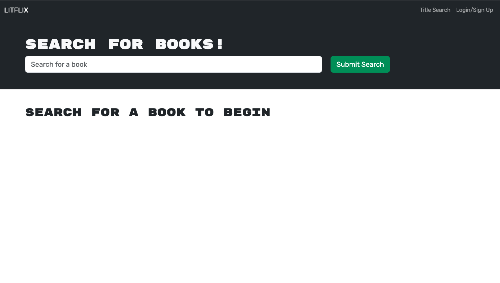
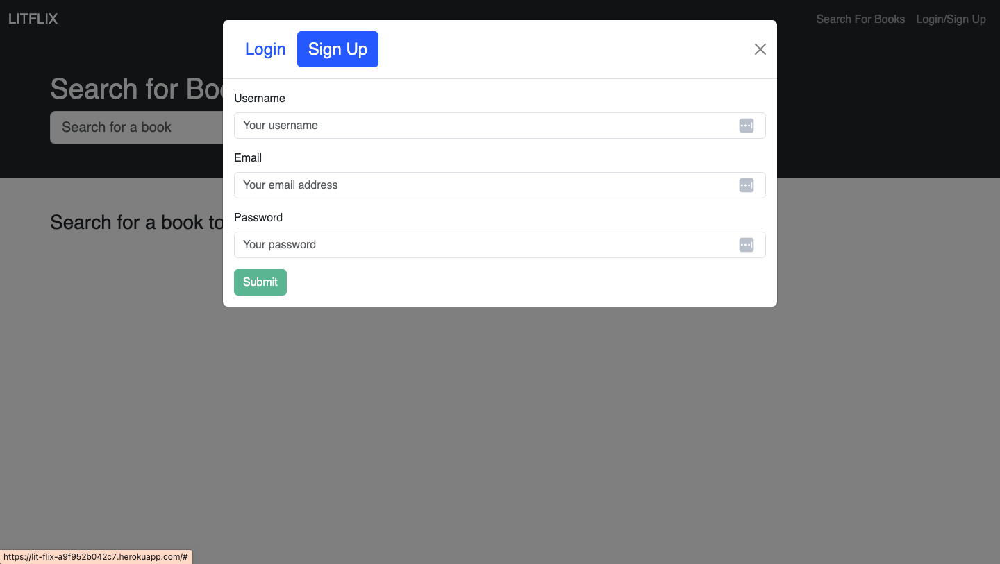
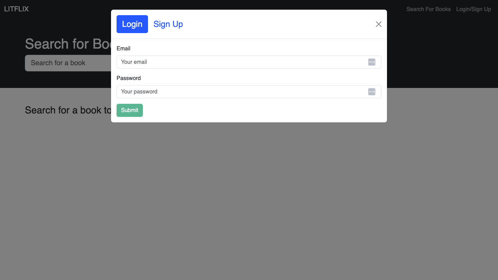

# LitFlix
## Description
LitFlix, the go-to platform for discovering movies that have been adapted from books. Whether a bookworm interested in seeing your favorite stories come to life on the big screen or a movie enthusiast looking for films with literary roots, our app has you covered.
Many challenges were faced during this process given the learning curve toward the new technology. However, the team was able to further expand their critical thinking skills and hone in on prior knowledge and skills.
### User Registration and Authentication
Account Creation:
New users can easily create an account by creating a username, providing an email, and creating a password.
Login:
Registered users can securely log in to access their accounts.
### Contact Us
If users have questions, feedback, or just want to say hello, our “Contact Us” feature allows you to reach out to our team directly. We value your input and are always here to assist you.
### Future Development
Future Development:
This application has plenty of room for growth. Some examples include:
-Movie vs Book rating system
-Live feed of new releases
-E-commerce to purchase books and related “Merch”
## Usage
You may access the website at the following URL:
https://lit-flix-a9f952b042c7.herokuapp.com/

The pages will welcome you with the following images:
Main:

Create Account:

Login:

<!-- Movie Search Results:

Contact Us:
 -->
## Technologies Used
Book adaptation search was built using the following technologies:
- *Frontend:* React, HTML, CSS, JavaScript
- *Backend:* Node.js, Express.js
- *Database:* MongoDB and the Mongoose ODM
- *Deployment:* Render
## Contributing
An essential aspect of successfully completing this project was the ability to collaborate effectively as a team. We would like to acknowledge the contributions of our teammates, Giselle Reyes, Annielys Sosa, Rujaine Mena, and Jovanni
Bogardus who played a crucial role in achieving the project’s objectives and meeting its acceptance criteria.
To supplement the design of the Portfolio, the following sites were utilized:
-Canva.com
-Google Fonts for unique fonts.
-W3 Schools
-MDN Web Docs
-YouTube
-ChatGPT
-Bootstrap
-BootCamp Tutors and Instructor
## License
This project is licensed under the [MIT License](LICENSE).
!License: MIT
